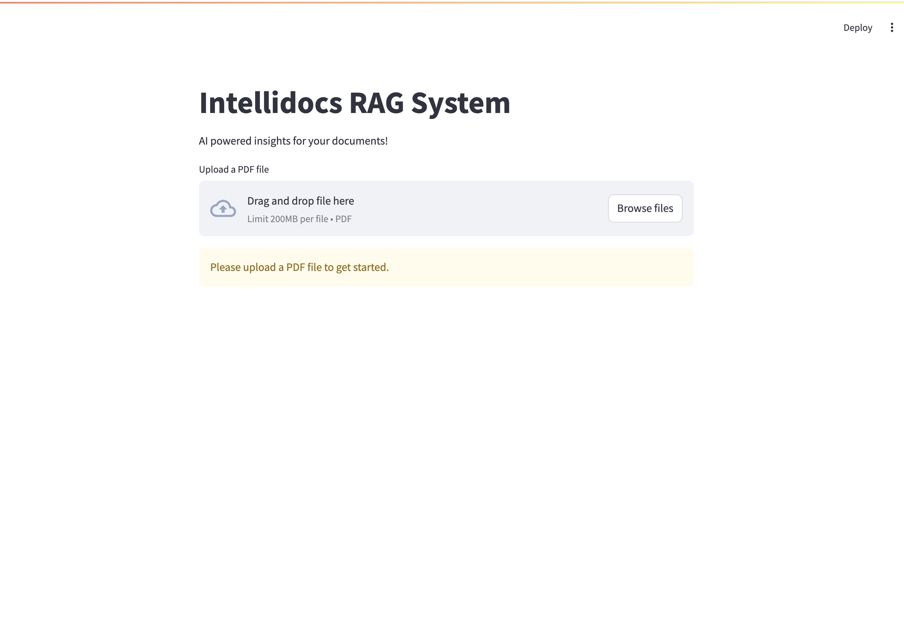
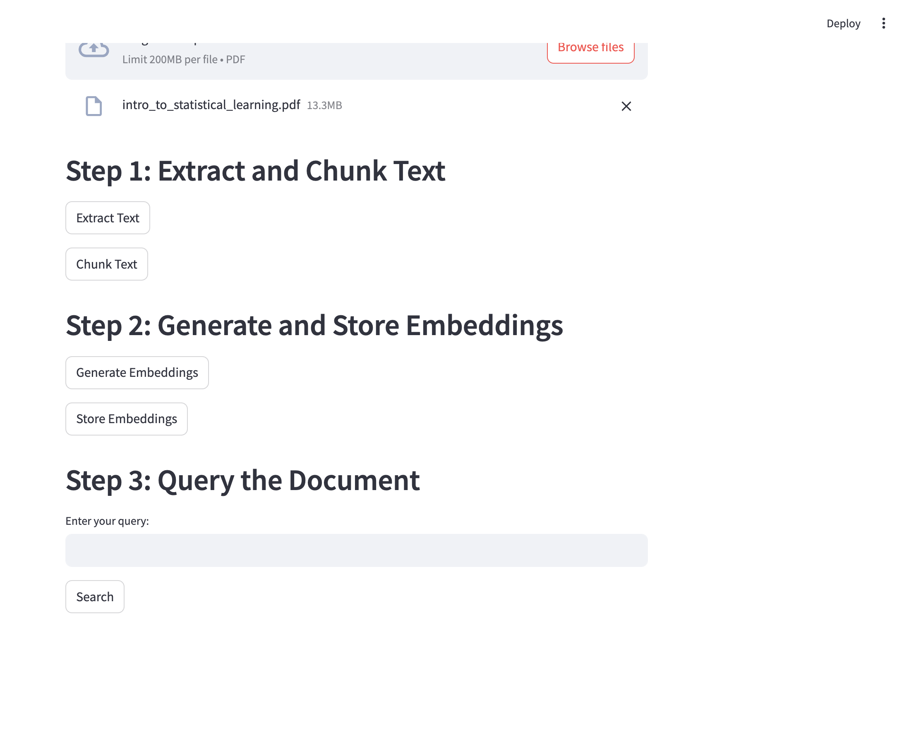
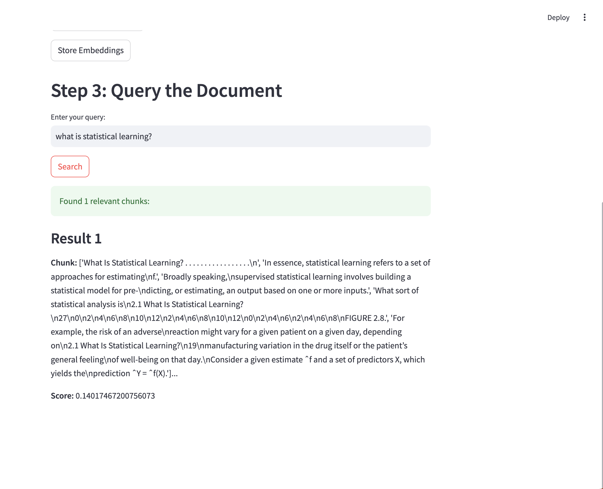

# IntelliDocs

## Overview

**IntelliDocs** is a Retrieval-Augmented Generation (RAG) based project designed to assist users in querying and extracting information from their PDF documents. By leveraging advanced natural language processing techniques, IntelliDocs enables users to efficiently retrieve relevant content from large volumes of text within PDFs.

## Project Objectives

1. **PDF Extraction**: Implement methods to extract text from PDF files, ensuring the preservation of formatting and structure.
2. **Text Processing**: Clean and tokenize extracted text to prepare it for chunking and embedding.
3. **Chunking**: Divide the processed text into manageable chunks to facilitate efficient querying.
4. **Embedding**: Use Sentence Transformers to generate embeddings for the text chunks, enabling semantic similarity searches.
5. **Querying**: Develop a retrieval system that allows users to input queries and receive relevant chunks of text based on semantic similarity.

## Technologies Used

- **Programming Language**: `Python`
- **Libraries**:
  - `fitz`: For PDF text extraction.
  - `sentence-transformers`: For embedding text chunks.
  - `Streamlit`: For creating the user interface (temporary).
  - `Chromadb`: For vector database.
  - `flask`: For backend (w.i.p)
- **Machine Learning**: Utilizes `pre-trained` embedding model for vector embeddings and uses `chromadb` to store them.

## Project Structure

```plaintext
├── README.md
├── app
│   ├── __init__.py
│   ├── routes 
// backend routes 
│   │   ├── __init__.py
│   │   ├── auth.py
│   │   ├── chat.py
│   │   ├── home.py
│   │   └── upload.py
│   ├── static 
// static files
│   │   ├── images
│   │   ├── intellidocsstyle.css
│   │   └── style.css
│   ├── templates
 // html templates
│   │   ├── auth
│   │   │   ├── login.html
│   │   │   └── signup.html
│   │   ├── index.html
│   │   └── intellidocschat.html
│   └── utils
 // backend utilities
│       ├── __init__.py
│       ├── decorators.py
│       └── helpers.py
├── app.py // single file backend logic (might delete later)
├── config
│   ├── __init__.py
│   └── settings.py // backend settings.py
├── id_chroma_db 
// cached chunks and embedding example
│   └── cache
│       ├── 0bed51f0d2edc69a7996e6142e4310d5_chunks.pkl
│       ├── 0bed51f0d2edc69a7996e6142e4310d5_embeddings.pkl
├── images
│   └── ui.png
├── model
│   ├── __init__.py
│   ├── intellidocs_main.py // Intellidocs main RAG instance
│   ├── intellidocs_rag_final
│   │   ├── __init__.py
│   │   └── id_chroma_rag.py // Intellidocs RAG main w chromadb
          // contains other versions of intellidocs RAG as well..
│   └── llms
│       ├── __init__.py
│       ├── gemini_response.py // gemini response
│       └── llama_response.py // llama response
├── pdfs
// pdf files for testing..
├── requirements.txt
├── run.py // backend runpoint
├── ui.py // streamlit application
├── uploads
// backend testing
└── utils
    ├── __init__.py
    ├── cleanup_chroma.py // clean up chroma db
    ├── constants.py // project constants
    └── dir_utils.py // directory utilities 
```

# Step-by-Step Guide to Clone and Run IntelliDocs

## Prerequisites

Ensure you have the following installed on your system:
- Python (version 3.7 or higher)
- pip (Python package installer)
- Git

## Step 1: Clone the Repository

Open your terminal or command prompt and run the following command:

```bash
git clone https://github.com/anishka07/intellidocs.git
```

## Step 2: Create a virtual environment using conda or virtual env and activate it

Run the following command:

```bash
## Example:
conda create -n your_env_name python=3.11 pip -y
conda activate your_env_name 
```

## Step 3: Install Requirements

Run the following command:

```bash
pip install -r requirements.txt
```

## Step 4: Run IntelliDocs from terminal or streamlit

To run IntelliDocs from terminal:

```bash
cd model
python intellidocs_main.py (make sure to checkt the file)
```

To run IntelliDocs from it's streamlit UI:

```bash
streamlit run ui.py
```

## Streamlit Interface





## Usage

1. **Input PDF**: Upload your PDF document using the Streamlit interface (for now).
2. **Querying**: Enter your query in the provided query field and submit.
3. **Results**: The system will return the most relevant text chunks extracted from the PDF based on your query.

## Future Work

- **Expand Support**: Extend support to other document formats (e.g., DOCX, TXT).
- **Web Application**: Create a full stack web application with apis.
- **Summarization**: Extracted text summarization using Tf-Idf


