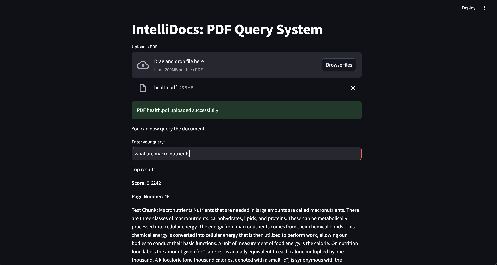

# IntelliDocs

## Overview

**IntelliDocs** is a Retrieval-Augmented Generation (RAG) based project designed to assist users in querying and extracting information from their PDF documents. By leveraging advanced natural language processing techniques, IntelliDocs enables users to efficiently retrieve relevant content from large volumes of text within PDFs.

## Project Objectives

1. **PDF Extraction**: Implement methods to extract text from PDF files, ensuring the preservation of formatting and structure.
2. **Text Processing**: Clean and tokenize extracted text to prepare it for chunking and embedding.
3. **Chunking**: Divide the processed text into manageable chunks to facilitate efficient querying.
4. **Embedding**: Use Sentence Transformers to generate embeddings for the text chunks, enabling semantic similarity searches.
5. **Querying**: Develop a retrieval system that allows users to input queries and receive relevant chunks of text based on semantic similarity.

## Technologies Used

- **Programming Language**: `Python`
- **Libraries**:
  - `pandas`: For data manipulation and embedding storage in csv format (no vector database used).
  - `sentence-transformers`: For embedding text chunks.
  - `fitz`: For PDF text extraction.
  - `Streamlit`: For creating user interface (temporary).
- **Machine Learning**: Utilizes `pre-trained` embedding model for vector embeddings but does not use vector database for storage.

## Project Structure

```plaintext
├── CSV_db
## your vector embeddings go here
├── README.md
├── model
│   ├── __init__.py
│   ├── intellidocs_main.py ## run this to get the gist of how the project 
works
│   ├── intellidocs_rag_final ## final RAG version
│   │   ├── __init__.py
│   │   ├── chunk_processor.py
│   │   ├── cosine_similarity.py
│   │   ├── embedding_process.py
│   │   ├── intellidocs_rag_constants.py
│   │   ├── pdf_loader.py
│   │   └── retrieval_process.py
│   ├── intellidocs_rag_v2
│   │   ├── __init__.py
│   │   └── intellidocs_RAG_V2.py
│   └── rag_gemini_v1
│       ├── __init__.py
│       ├── document_processor.py
│       ├── faiss_saver_and_responser.py
│       └── text_processor.py
├── notebooks
│   ├── RAG_from_scratch.ipynb
├── pdfs
## your pdf files go here
├── requirements.txt
├── ui.py
└── utils
    ├── __init__.py
    └── constants.py ## project constants inc. paths 

```

# Step-by-Step Guide to Clone and Run IntelliDocs

## Prerequisites

Ensure you have the following installed on your system:
- Python (version 3.7 or higher)
- pip (Python package installer)
- Git

## Step 1: Clone the Repository

Open your terminal or command prompt and run the following command:

```bash
git clone https://github.com/anishka07/intellidocs.git
```

## Step 2: Create a virtual environment using conda or virtual env and activate it

Run the following command:

```bash
## Example:
conda create -n your_env_name python=3.11 pip -y
conda activate your_env_name 
```

## Step 3: Install Requirements

Run the following command:

```bash
pip install -r requirements.txt
```

## Step 4: Run IntelliDocs from terminal or streamlit

To run IntelliDocs from terminal:

```bash
cd model
python intellidocs_main.py (make sure to checkt the file)
```

To run IntelliDocs from it's streamlit UI:

```bash
streamlit run ui.py
```

## Streamlit Interface



## Usage

1. **Input PDF**: Upload your PDF document using the Streamlit interface (for now).
2. **Querying**: Enter your query in the provided input field and submit.
3. **Results**: The system will return the most relevant text chunks extracted from the PDF based on your query.

## Future Work

- **Expand Support**: Extend support to other document formats (e.g., DOCX, TXT).
- **Web Application**: Create a full stack web application with apis.
- **Summarization**: Extracted text summarization using Tf-Idf


